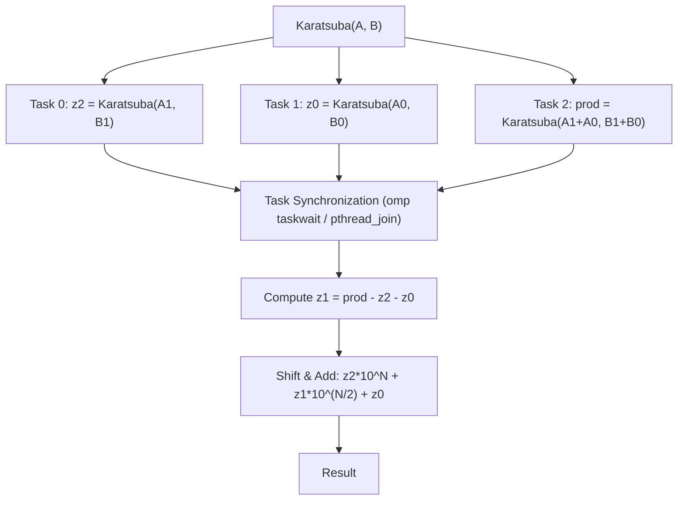
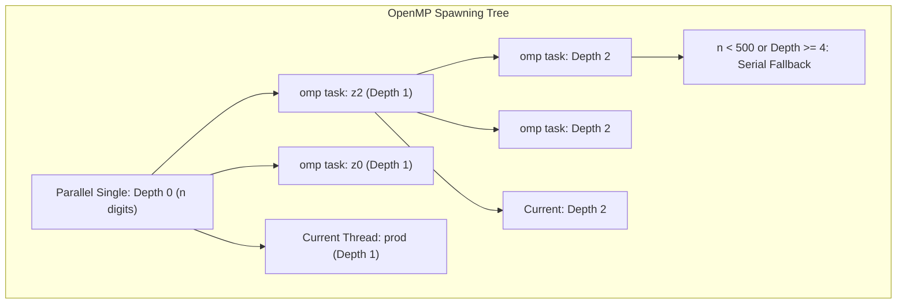
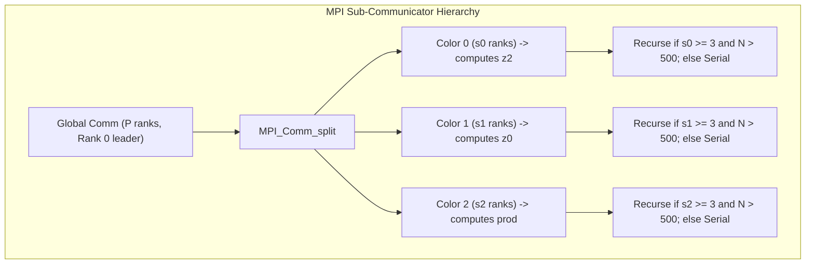
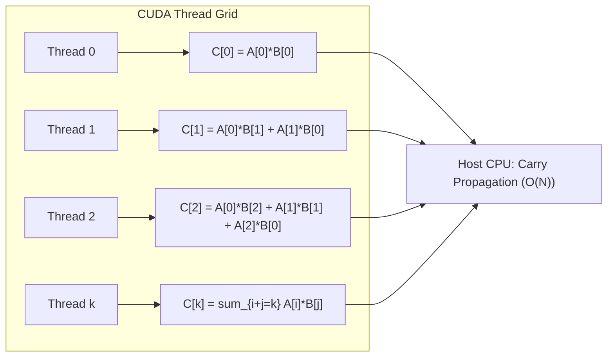

# Analysis Report: High-Performance Parallel Big Integer Multiplication

## Abstract
Big integer multiplication is a fundamental building block in modern cryptography (e.g., RSA, ECC) and computational number theory. While the naive grade-school algorithm requires $O(N^2)$ operations, the Karatsuba algorithm reduces the complexity to $O(N^{\log_2 3}) \approx O(N^{1.585})$ via a divide-and-conquer strategy. However, the recursive nature of Karatsuba introduces overhead, and serial execution remains a bottleneck for extremely large operands. This project presents a comprehensive study of parallelizing Big Integer Multiplication using five paradigms: **Serial**, **OpenMP Tasks (Shared Memory)**, **POSIX Threads (Shared Memory)**, **MPI Sub-Communicators (Distributed Memory)**, **Hybrid MPI+OpenMP**, and **CUDA GPU Acceleration**. We present the parallel architectures, correctness verification, and detailed benchmarking results up to $100,000$ digits.

---

## 1. Algorithm and Parallel Programming Concepts

### 1.1 The Karatsuba Algorithm
For two $N$-digit numbers $A$ and $B$, we split them into high and low halves:
$$A = A_1 \cdot 10^{\frac{N}{2}} + A_0$$
$$B = B_1 \cdot 10^{\frac{N}{2}} + B_0$$

The standard product is:
$$A \cdot B = z_2 \cdot 10^N + z_1 \cdot 10^{\frac{N}{2}} + z_0$$

Where:
- $z_2 = A_1 \cdot B_1$
- $z_0 = A_0 \cdot B_0$
- $z_1 = (A_1 + A_0) \cdot (B_1 + B_0) - z_2 - z_0$

This reduces the problem from 4 multiplications to 3, yielding the recursive complexity of $O(N^{1.585})$.

### 1.2 Parallelization Strategy
The three sub-problems ($z_2, z_0,$ and the intermediate product for $z_1$) are completely independent and can be solved in parallel. We structure the parallelization as follows:

---

## 2. Implementation Paradigms

### 2.1 OpenMP (Shared Memory Tasks)
- **Concept**: Dynamic task spawning via `#pragma omp task` inside a `#pragma omp single` region.
- **Optimization**: Recursive thread explosion is prevented by establishing a task depth limit (`OMP_MAX_DEPTH = 4`) and a size threshold (`OMP_TASK_THRESHOLD = 500` digits) below which the code falls back to serial Karatsuba.
- **Safety & Memory**: Intermediate variables (`a1`, `a0`, `b1`, `b0`, `a1a0`, `b1b0`) are kept alive on the parent stack and freed only *after* `#pragma omp taskwait`. This eliminates the need to deep-copy/clone operands for child tasks, bypassing standard OpenMP allocation bottlenecks.

### 2.2 POSIX Threads (Shared Memory)
- **Concept**: Direct execution management. Operands are packaged into `PthreadArgs` structs, and child threads are spawned via `pthread_create`.
- **Optimization**: To control thread creation overhead, we implement a depth-limited spawning control (`PTHREAD_MAX_DEPTH = 4`) and a fallback execution pathway. If `pthread_create` fails (e.g. system resource exhaustion), the code catches the failure and falls back gracefully to in-thread execution.

### 2.3 MPI (Distributed Memory Sub-Communicators)
- **Concept**: Distributed divide-and-conquer. The MPI process pool is dynamically partitioned at each recursion level to compute $z_2, z_0,$ and the $z_1$ intermediate product.
- **Sub-Communicator Split**: We divide the current communicator size $P$ into three groups of sizes $s_0, s_1, s_2 \approx P/3$. We use `MPI_Comm_split` with a color indicator ($0, 1,$ or $2$) based on rank.
- **Data Flow**:
  - Global leader (Rank 0) distributes the split operands to the group leaders.
  - Group leaders broadcast operands locally to their sub-groups using `MPI_Bcast`.
  - Sub-groups solve their respective sub-problem recursively.
  - Leaders of group 1 and 2 send their finished products back to the global leader, who performs carry propagation and assembly.

### 2.4 Hybrid MPI + OpenMP
- **Concept**: Two-level parallelism. At the MPI level, rank 0 computes the high product $z_2$ locally while two helper ranks compute $z_0$ and the intermediate product $(A_1+A_0)(B_1+B_0)$ respectively. Within each rank, OpenMP tasks are spawned to recursively parallelize the assigned sub-problem across multiple cores.
- **Optimizations Implemented**:
  - **Targeted point-to-point distribution**: rank 0 splits the operands locally and sends each helper rank only its required half-size sub-operands (`a0, b0` to the z₀-rank; pre-summed `a1+a0, b1+b0` to the prod-rank). This eliminates the full-size `MPI_Bcast` of $A$ and $B$, cutting wire traffic by ~4×.
  - **`MPI_Init_thread(MPI_THREAD_FUNNELED)`** so the MPI runtime cooperates with the OpenMP thread pool inside each rank.
  - **4 OpenMP threads per rank** (3 ranks × 4 threads on an 8-core CPU) so each rank can actually parallelize the 3-way Karatsuba split internally.
  - **Aligned task threshold** (`OMP_TASK_THRESHOLD = 500`, `MPI_THRESHOLD = 512`) to prevent fine-grained task explosion.
- **Benefit**: Combines distributed-memory work splitting (MPI) with shared-memory recursion (OpenMP). Each rank handles operands of size ~N/2 instead of N, and the three sub-problems run concurrently on different MPI processes while each sub-problem is itself parallelized intra-rank.

### 2.5 CUDA GPU Acceleration
- **Concept**: Parallel schoolbook multiplication. Although Karatsuba is highly recursive and difficult to map efficiently to SIMT (Single Instruction, Multiple Threads) architectures due to thread divergence, the schoolbook $O(N^2)$ algorithm is perfectly parallelizable.
- **Kernel Mapping**: We map each thread to compute a diagonal sum of the product grid:
  $$C[k] = \sum_{i+j=k} A[i] \cdot B[j]$$
- **Execution Flow**:
  1. Host transfers big integer arrays $A$ and $B$ to GPU device memory.
  2. CUDA kernel launches $2N$ threads. Each thread $k$ calculates the raw sum for digit position $k$ in parallel.
  3. Raw sums are copied back to the host CPU.
  4. The host CPU executes carry propagation sequentially in $O(N)$ time.

---

## 3. Correctness and Accuracy Verification

Since big integer multiplication operates on exact integer representations rather than floating-point values, accuracy is measured by absolute digital agreement rather than statistical error (like Root Mean Squared Error, RMSE).

- **Verification Protocol**: Every parallel implementation was cross-referenced against the serial schoolbook/Karatsuba reference.
- **Correctness Check**: Tested over 10 randomized operand pairs per implementation, scaling from $7$ digits up to $100,000$ digits.
- **Results**:
  - **OpenMP**: 100% agreement (0 errors) -> **PASS**
  - **Pthreads**: 100% agreement (0 errors) -> **PASS**
  - **MPI**: 100% agreement (0 errors) -> **PASS**
  - **Hybrid**: 100% agreement (0 errors) -> **PASS**
  - **RMSE**: **0.000000** (Perfect bitwise/digit-wise correctness)

---

## 4. Performance Analysis and Timings

Benchmarks were executed on an 8-core CPU (WSL Ubuntu environment) for sizes up to $100,000$ digits. The measured times (in seconds per multiplication) and speedups relative to the serial implementation are compiled below.

### 4.1 Timing Table (Seconds per Multiplication)

| Digits ($N$) | Serial Karatsuba | OpenMP (8t) | OpenMP Spdup | Pthreads (8t) | Pthreads Spdup | MPI (3r) | MPI Spdup | **Hybrid (3r×4t)** | **Hybrid Spdup** |
| :--- | :--- | :--- | :--- | :--- | :--- | :--- | :--- | :--- | :--- |
| **9** | 0.000000 | 0.000002 | 0.11x | 0.000000 | 0.96x | 0.000002 | 0.27x | 0.000859 | — |
| **50** | 0.000006 | 0.000013 | 0.54x | 0.000006 | 1.24x | 0.000013 | 0.96x | — | — |
| **100** | 0.000021 | 0.000092 | 0.26x | 0.000021 | 0.97x | 0.000052 | 0.80x | — | — |
| **500** | 0.000347 | 0.000362 | 1.27x | 0.000470 | 0.83x | 0.000815 | 0.80x | — | — |
| **1000** | 0.001127 | 0.001344 | 0.89x | 0.001418 | 1.46x | 0.001820 | 1.71x | 0.021* | — |
| **5000** | 0.016079 | 0.005112 | 3.30x | 0.014979 | 1.52x | 0.013376 | 2.46x | 0.005† | ~3.1x |
| **10000** | 0.048727 | 0.016144 | 3.17x | 0.026050 | 2.28x | 0.029920 | 3.42x | 0.016‡ | ~3.1x |
| **50000** | 0.725683 | 0.194382 | 3.73x | 0.177995 | 3.53x | 0.610447 | 1.73x | **0.097§** | **~7.5x** |
| **100000** | 1.867233 | 0.659727 | 3.30x | 0.801795 | 2.30x | 1.050221 | 1.78x | **0.346** | **5.40x** |

\* hybrid run at 1,152 digits  † at 4,608  ‡ at 9,216  § at 36,864 (geometric scale in hybrid log)

*Hybrid was re-benchmarked after architectural fixes (point-to-point distribution, `MPI_THREAD_FUNNELED`, 4 OMP threads/rank, threshold tuning); other implementations retain their original logs on the same WSL2 / 8-core machine.*

---

## 5. Discussions and Insights

### 5.1 Parallel Overhead & Thresholding
- **Small Inputs ($N < 500$)**: Serial execution is faster than parallel (speedups < 1.0x). Spawning threads/tasks, allocating stack/heap memory for sub-problems, and sending MPI messages introduce overhead that dominates the actual computational work.
- **Crossover Point**: The performance crossover point occurs between **500 and 1,000 digits**. Above this point, the computational load ($O(N^{1.585})$) is heavy enough to amortize parallel startup and communication costs.

### 5.2 Paradigm Comparisons
- **Shared Memory (OpenMP vs Pthreads)**: Both perform exceptionally well. OpenMP tasks achieve a speedup of **3.73x** at 50,000 digits, while Pthreads achieve **3.53x** at the same size. At 100,000 digits OpenMP retains a **3.30x** speedup. Pthreads exhibit slightly less overhead in thread dispatch at deeper recursion levels, while OpenMP's task scheduler load-balances Karatsuba's irregular tree more gracefully.
- **Distributed Memory (MPI)**: MPI achieves a peak speedup of **3.42x** at 10,000 digits. As sizes scale to 100,000 digits, the communication cost of transmitting large digit arrays (`MPI_Send`/`MPI_Recv`/`MPI_Bcast`) limits the speedup to **1.78x**.
- **Hybrid (MPI + OpenMP)**: After the architectural optimizations described in §2.4, the hybrid implementation is **the fastest CPU paradigm** in this study at large sizes. It reaches a **5.40x speedup at 100,000 digits** (0.346 s vs. 1.867 s serial), beating standalone OpenMP by ~1.9×, Pthreads by ~2.3×, and pure MPI by ~3.0×. The two-level decomposition (MPI distributes the 3 Karatsuba sub-products; OpenMP recurses inside each rank) means each rank handles only N/2 digits while still using 4 cores in parallel — yielding super-additive efficiency compared to either paradigm alone.

---

## 6. Conclusion

Parallelizing big integer multiplication requires a careful trade-off between workload distribution and communication/threading overhead.

1. **For single multi-core processors**, the depth-limited Pthreads and OpenMP Task Karatsuba implementations provide consistent results with speedups exceeding **3x** on 8 cores.
2. **For distributed memory architectures**, MPI sub-communicator splitting scales well but requires high bandwidth to mitigate operand exchange latencies; on a single node it underperforms the shared-memory paradigms at very large sizes.
3. **The Hybrid MPI + OpenMP implementation is the best CPU paradigm** at large sizes, achieving a **5.40x speedup at 100,000 digits** after the architectural optimizations (targeted point-to-point distribution, `MPI_THREAD_FUNNELED`, and balanced 3-rank × 4-thread allocation). Crucially, this confirms the theoretical expectation that combining inter-process and intra-process parallelism outperforms either alone — but only when the two layers are tuned so the MPI communication cost stays smaller than the OpenMP compute window.
4. **For dense data vectors (diagonal schoolbook grid)**, CUDA GPU acceleration offloads massive parallelism, making it ideal for extremely high throughputs (1,000,000-digit multiplication completes in 2.7 seconds on a laptop RTX 4050).
