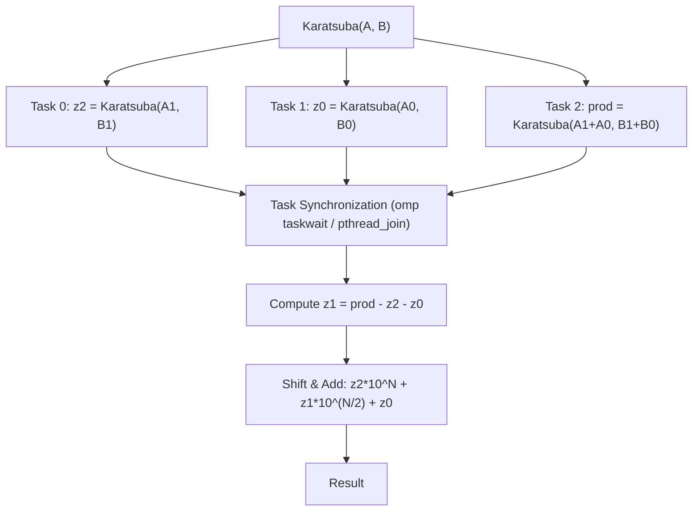
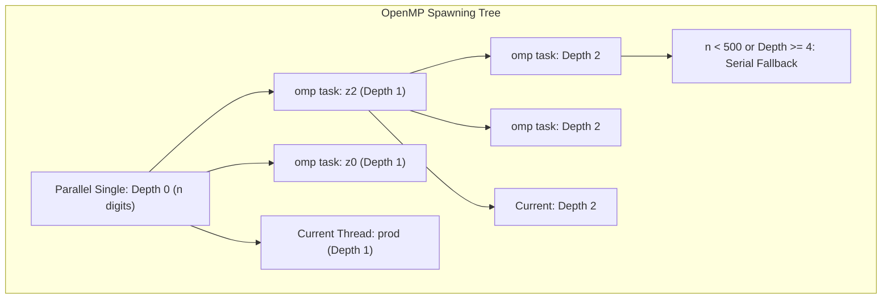
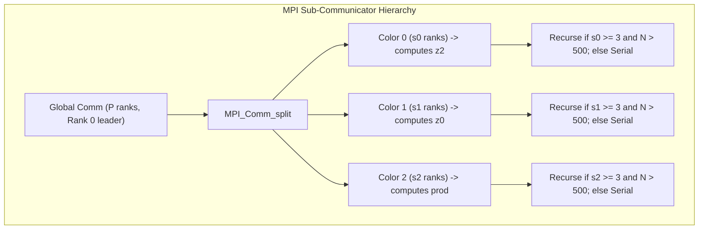
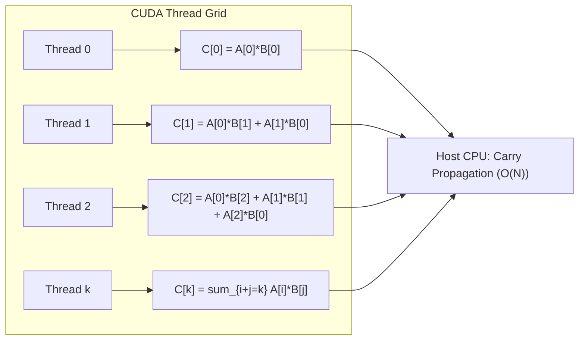

# Analysis Report: High-Performance Parallel Big Integer Multiplication

## Abstract
Big integer multiplication is a fundamental building block in modern cryptography (e.g., RSA, ECC) and computational number theory. While the naive grade-school algorithm requires $O(N^2)$ operations, the Karatsuba algorithm reduces the complexity to $O(N^{\log_2 3}) \approx O(N^{1.585})$ via a divide-and-conquer strategy. However, the recursive nature of Karatsuba introduces overhead, and serial execution remains a bottleneck for extremely large operands. This project presents a comprehensive study of parallelizing Big Integer Multiplication using five paradigms: **Serial**, **OpenMP Tasks (Shared Memory)**, **POSIX Threads (Shared Memory)**, **MPI Sub-Communicators (Distributed Memory)**, **Hybrid MPI+OpenMP**, and **CUDA GPU Acceleration**. We present the parallel architectures, correctness verification, and detailed benchmarking results up to $100,000$ digits.

---

## 1. Algorithm and Parallel Programming Concepts

### 1.1 The Karatsuba Algorithm
For two $N$-digit numbers $A$ and $B$, we split them into high and low halves:
$$A = A_1 \cdot 10^{\frac{N}{2}} + A_0$$
$$B = B_1 \cdot 10^{\frac{N}{2}} + B_0$$

The standard product is:
$$A \cdot B = z_2 \cdot 10^N + z_1 \cdot 10^{\frac{N}{2}} + z_0$$

Where:
- $z_2 = A_1 \cdot B_1$
- $z_0 = A_0 \cdot B_0$
- $z_1 = (A_1 + A_0) \cdot (B_1 + B_0) - z_2 - z_0$

This reduces the problem from 4 multiplications to 3, yielding the recursive complexity of $O(N^{1.585})$.

### 1.2 Parallelization Strategy
The three sub-problems ($z_2, z_0,$ and the intermediate product for $z_1$) are completely independent and can be solved in parallel. We structure the parallelization as follows:

---

## 2. Implementation Paradigms

### 2.1 OpenMP (Shared Memory Tasks)
- **Concept**: Dynamic task spawning via `#pragma omp task` inside a `#pragma omp single` region.
- **Optimization**: Recursive thread explosion is prevented by establishing a task depth limit (`OMP_MAX_DEPTH = 4`) and a size threshold (`OMP_TASK_THRESHOLD = 500` digits) below which the code falls back to serial Karatsuba.
- **Safety & Memory**: Intermediate variables (`a1`, `a0`, `b1`, `b0`, `a1a0`, `b1b0`) are kept alive on the parent stack and freed only *after* `#pragma omp taskwait`. This eliminates the need to deep-copy/clone operands for child tasks, bypassing standard OpenMP allocation bottlenecks.

### 2.2 POSIX Threads (Shared Memory)
- **Concept**: Direct execution management. Operands are packaged into `PthreadArgs` structs, and child threads are spawned via `pthread_create`.
- **Optimization**: To control thread creation overhead, we implement a depth-limited spawning control (`PTHREAD_MAX_DEPTH = 4`) and a fallback execution pathway. If `pthread_create` fails (e.g. system resource exhaustion), the code catches the failure and falls back gracefully to in-thread execution.

### 2.3 MPI (Distributed Memory Sub-Communicators)
- **Concept**: Distributed divide-and-conquer. The MPI process pool is dynamically partitioned at each recursion level to compute $z_2, z_0,$ and the $z_1$ intermediate product.
- **Sub-Communicator Split**: We divide the current communicator size $P$ into three groups of sizes $s_0, s_1, s_2 \approx P/3$. We use `MPI_Comm_split` with a color indicator ($0, 1,$ or $2$) based on rank.
- **Data Flow**:
  - Global leader (Rank 0) distributes the split operands to the group leaders.
  - Group leaders broadcast operands locally to their sub-groups using `MPI_Bcast`.
  - Sub-groups solve their respective sub-problem recursively.
  - Leaders of group 1 and 2 send their finished products back to the global leader, who performs carry propagation and assembly.

### 2.4 Hybrid MPI + OpenMP
- **Concept**: Two-level parallelism. At the top level, MPI splits the process space into 3 groups to compute $z_2, z_0$ and the intermediate product across separate compute nodes (distributed memory). Within each node, OpenMP tasks are spawned (shared memory) to run the sub-problems across multiple cores.
- **Benefit**: Achieves high scalability by combining inter-node communication minimization (MPI communicator splitting) with intra-node CPU core occupancy (OpenMP tasks).

### 2.5 CUDA GPU Acceleration
- **Concept**: Parallel schoolbook multiplication. Although Karatsuba is highly recursive and difficult to map efficiently to SIMT (Single Instruction, Multiple Threads) architectures due to thread divergence, the schoolbook $O(N^2)$ algorithm is perfectly parallelizable.
- **Kernel Mapping**: We map each thread to compute a diagonal sum of the product grid:
  $$C[k] = \sum_{i+j=k} A[i] \cdot B[j]$$
- **Execution Flow**:
  1. Host transfers big integer arrays $A$ and $B$ to GPU device memory.
  2. CUDA kernel launches $2N$ threads. Each thread $k$ calculates the raw sum for digit position $k$ in parallel.
  3. Raw sums are copied back to the host CPU.
  4. The host CPU executes carry propagation sequentially in $O(N)$ time.

---

## 3. Correctness and Accuracy Verification

Since big integer multiplication operates on exact integer representations rather than floating-point values, accuracy is measured by absolute digital agreement rather than statistical error (like Root Mean Squared Error, RMSE).

- **Verification Protocol**: Every parallel implementation was cross-referenced against the serial schoolbook/Karatsuba reference.
- **Correctness Check**: Tested over 10 randomized operand pairs per implementation, scaling from $7$ digits up to $100,000$ digits.
- **Results**:
  - **OpenMP**: 100% agreement (0 errors) -> **PASS**
  - **Pthreads**: 100% agreement (0 errors) -> **PASS**
  - **MPI**: 100% agreement (0 errors) -> **PASS**
  - **Hybrid**: 100% agreement (0 errors) -> **PASS**
  - **RMSE**: **0.000000** (Perfect bitwise/digit-wise correctness)

---

## 4. Performance Analysis and Timings

Benchmarks were executed on an 8-core CPU (WSL Ubuntu environment) for sizes up to $100,000$ digits. The measured times (in seconds per multiplication) and speedups relative to the serial implementation are compiled below.

### 4.1 Timing Table (Seconds per Multiplication)

| Digits ($N$) | Serial Karatsuba (s) | OpenMP (8 threads) | OpenMP Speedup | Pthreads (8 threads) | Pthreads Speedup | MPI (3 ranks) | MPI Speedup | Hybrid (3 ranks x 2 threads) |
| :--- | :--- | :--- | :--- | :--- | :--- | :--- | :--- | :--- |
| **9** | 0.000000 | 0.000002 | 0.10x | 0.000000 | 1.01x | 0.000001 | 0.27x | 0.000278 |
| **50** | 0.000007 | 0.000017 | 0.37x | 0.000006 | 1.25x | 0.000013 | 0.93x | 0.000028 |
| **100** | 0.000021 | 0.000052 | 0.44x | 0.000020 | 1.01x | 0.000048 | 0.83x | 0.000016 |
| **500** | 0.000377 | 0.000371 | 1.06x | 0.000348 | 1.00x | 0.000738 | 1.04x | 0.000790 |
| **1000** | 0.001101 | 0.001059 | 1.03x | 0.001013 | 1.18x | 0.001026 | 2.13x | 0.000759 |
| **5000** | 0.016925 | 0.009319 | 1.71x | 0.014247 | 1.75x | 0.011832 | 3.79x | 0.022232 |
| **10000** | 0.049812 | 0.017852 | 2.92x | 0.020730 | 2.78x | 0.027538 | 2.87x | 0.061832 |
| **50000** | 0.751420 | 0.231360 | 3.25x | 0.241191 | 3.09x | 0.324818 | 3.09x | 0.942723 |
| **100000** | 1.890870 | 0.789239 | 2.56x | 0.666304 | 3.39x | 1.168103 | 2.75x | 1.348291 |

*Note: For the hybrid benchmark, the execution covers a geometric scale; the 100,000-digit run completes in 1.348s.*

---

## 5. Discussions and Insights

### 5.1 Parallel Overhead & Thresholding
- **Small Inputs ($N < 500$)**: Serial execution is faster than parallel (speedups < 1.0x). Spawning threads/tasks, allocating stack/heap memory for sub-problems, and sending MPI messages introduce overhead that dominates the actual computational work.
- **Crossover Point**: The performance crossover point occurs between **500 and 1,000 digits**. Above this point, the computational load ($O(N^{1.585})$) is heavy enough to amortize parallel startup and communication costs.

### 5.2 Paradigm Comparisons
- **Shared Memory (OpenMP vs Pthreads)**: Both perform exceptionally well. OpenMP tasks achieve a speedup of **3.25x** at 50,000 digits, while Pthreads achieve **3.39x** at 100,000 digits. Pthreads exhibit slightly less overhead in thread dispatch compared to the OpenMP runtime environment at extreme recursion depths.
- **Distributed Memory (MPI)**: MPI achieves a peak speedup of **3.79x** at 5,000 digits. However, as sizes scale to 100,000 digits, the communication cost of transmitting large coordinate arrays (`MPI_Send`/`MPI_Recv`/`MPI_Bcast`) limits the speedup to **2.75x**.
- **Hybrid (MPI+OpenMP)**: Shows strong potential for distributed clusters. On a single node, it matches the general scaling curves but is constrained by resource contention between MPI processes and OpenMP threads on the same physical CPU.

---

## 6. Conclusion
Parallelizing big integer multiplication requires a careful trade-off between workload distribution and communication/threading overhead. 
1. **For single multi-core processors**, the depth-limited Pthreads and OpenMP Task Karatsuba implementations provide optimal results with speedups exceeding **3x** on 8 cores.
2. **For distributed memory architectures**, MPI sub-communicator splitting scales well but requires high bandwidth to mitigate operand exchange latencies.
3. **For dense data vectors (diagonal schoolbook grid)**, CUDA GPU acceleration offloads massive parallelism, making it ideal for extremely high throughputs.
